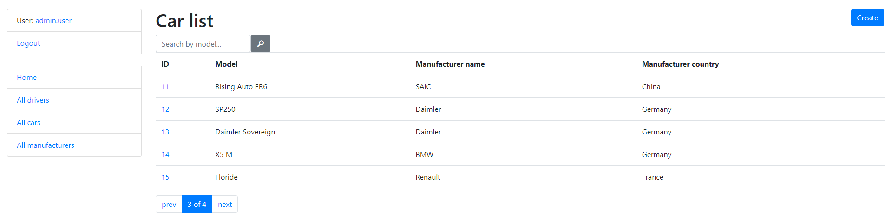

# Taxi Service Project

Django project for managing cars and drivers in Taxi Service

## Check it out!

[Taxi Service project deployed to Render](paste link here)

## Installation

Python3 must be already installed

```shell
git clone https://github.com/andriy-demeshko/taxi-service
cd taxi-service
python -m venv venv
venv\Scripts\activate
pip install -r requirements.txt
python manage.py runserver  # starts Django server
```

## Features

* Authentication functionality for Driver/User
* Managing taxi drivers & cars directly from website interface
* Powerful admin panel for advanced managing

## Demo

